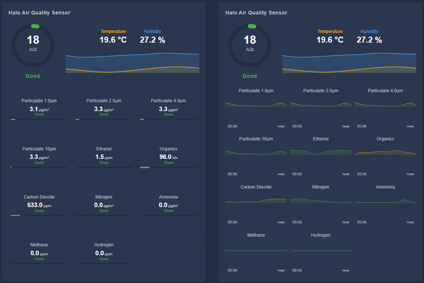

# Air Quality Card for Home Assistant

A HACS-compatible Lovelace card that displays a composite air quality score, pollutant breakdowns, and environmental trends — all driven by your own sensor entities.



## Features

- Circular AQI gauge with color-coded score and Good / Moderate / Poor / Bad label
- Pollutant tiles: PM1.0, PM2.5, PM4.0, PM10, VOC, CO₂, NO₂, NH₃, CH₄, H₂, C₂H₅OH, RH — each with threshold-based status label and progress bar
- Temperature and humidity current values with 24-hour combined trend graph via [mini-graph-card](https://github.com/kalkih/mini-graph-card)
- Tap any tile to open the entity's detail popup
- Visual config editor with entity pickers — no YAML required
- Per-card configurable thresholds for every pollutant tile, with sensible defaults
- Graceful unavailable/unknown state handling — gauge and tiles clearly indicate when a sensor is offline
- Supports a native AQI entity (uses the sensor value directly) or computes a score from PM2.5, VOC, and CO₂
- No hardcoded entities; works with any sensor integration

## Installation

### HACS (recommended)

1. In HACS → Frontend, click the three-dot menu → **Custom repositories**
2. Add `https://github.com/wander00-1/ha-air-quality-card` as type **Dashboard**
3. Install **Air Quality Card**
4. Reload your browser

### Manual

Copy `air-quality-card.js` to `/config/www/` and add a Lovelace resource:

```yaml
url: /local/air-quality-card.js
type: module
```

## Dependencies

Install [mini-graph-card](https://github.com/kalkih/mini-graph-card) via HACS for the temperature and humidity trend graph. The card renders without it — the graph slot will be empty.

## Configuration

Use the visual editor, or add YAML manually:

```yaml
type: custom:air-quality-card
aqi_entity: sensor.air_quality_index        # optional — uses value directly
pm25_entity: sensor.particulate_matter_2_5um
pm1_entity: sensor.particulate_matter_1um
pm4_entity: sensor.particulate_matter_4um
pm10_entity: sensor.particulate_matter_10um
voc_entity: sensor.volatile_organic_compounds_index
co2_entity: sensor.carbon_dioxide
no2_entity: sensor.nitrogen_dioxide
temperature_entity: sensor.temperature
humidity_entity: sensor.humidity
show_name: true
tile_tap_enabled: true
```

### Entity keys

| Key | Required | Description |
|-----|:--------:|-------------|
| `aqi_entity` | — | Native AQI sensor — value used directly; falls back to computed score |
| `pm25_entity` | ✅* | PM2.5 sensor (µg/m³) — used for scoring |
| `pm1_entity` | — | PM1.0 sensor (µg/m³) |
| `pm4_entity` | — | PM4.0 sensor (µg/m³) |
| `pm10_entity` | — | PM10 sensor (µg/m³) |
| `voc_entity` | — | VOC index sensor — used for scoring |
| `co2_entity` | — | CO₂ sensor (ppm) — used for scoring |
| `no2_entity` | — | NO₂ sensor (µg/m³) |
| `nh3_entity` | — | NH₃ ammonia sensor (µg/m³) |
| `ch4_entity` | — | CH₄ methane sensor (ppm) |
| `h2_entity` | — | H₂ hydrogen sensor (ppm) |
| `ethanol_entity` | — | C₂H₅OH ethanol sensor (ppm) |
| `rh_entity` | — | Relative humidity tile (%) |
| `temperature_entity` | — | Temperature sensor (value display + trend graph) |
| `humidity_entity` | — | Humidity sensor (value display + trend graph) |

*`pm25_entity` is required unless `aqi_entity` is provided.

### Display options

| Key | Default | Description |
|-----|:-------:|-------------|
| `show_name` | `true` | Show device name above the card |
| `name` | — | Override the device name with a custom string |
| `tile_tap_enabled` | `true` | Tap a pollutant tile to open its entity detail popup |

## Scoring

### Native AQI entity

If `aqi_entity` is configured, the sensor value is used directly and displayed as-is in the gauge. This supports any scale — including the US AQI (0–500). The gauge arc fills proportionally up to a maximum of 100, so values above 100 show a full circle.

| Score | Status |
|:-----:|--------|
| 0–50 | Good |
| 51–100 | Moderate |
| 101–200 | Poor |
| > 200 | Bad |

### Computed score

If no `aqi_entity` is provided, a score from **0 (clean) to 100 (very polluted)** is computed from available sensors. Unavailable sensors are skipped rather than assumed clean.

| Pollutant | Max Penalty | Reference |
|-----------|:-----------:|-----------|
| PM2.5 | 40 pts | WHO 24h guideline (35 µg/m³) |
| VOC | 25 pts | Index 300 |
| CO₂ | 35 pts | Baseline 400 ppm, ceiling 2000 ppm |

| Score | Status |
|:-----:|--------|
| 0–25 | Good |
| 26–50 | Moderate |
| 51–75 | Poor |
| 76–100 | Bad |

If no scoring entity is available the gauge displays `—` and shows "Unavailable".

## Tile Thresholds

Default thresholds (all configurable per card in the visual editor):

| Pollutant | Good | Moderate | High | Very High |
|-----------|------|----------|------|-----------|
| PM1.0 | ≤ 10 µg/m³ | ≤ 25 | ≤ 50 | > 50 |
| PM2.5 | ≤ 12 µg/m³ | ≤ 35 | ≤ 55 | > 55 |
| PM4.0 | ≤ 12 µg/m³ | ≤ 35 | ≤ 55 | > 55 |
| PM10 | ≤ 50 µg/m³ | ≤ 100 | ≤ 150 | > 150 |
| VOC | ≤ 150 idx | ≤ 250 | ≤ 400 | > 400 |
| CO₂ | ≤ 800 ppm | ≤ 1000 | ≤ 1500 | > 1500 |
| NO₂ | ≤ 40 µg/m³ | ≤ 100 | ≤ 200 | > 200 |
| NH₃ | ≤ 200 µg/m³ | ≤ 1000 | ≤ 1500 | > 1500 |
| CH₄ | ≤ 1000 ppm | ≤ 5000 | ≤ 25000 | > 25000 |
| H₂ | ≤ 500 ppm | ≤ 2000 | ≤ 10000 | > 10000 |
| C₂H₅OH | ≤ 100 ppm | ≤ 500 | ≤ 1000 | > 1000 |
| RH | ≤ 60 % | ≤ 70 | ≤ 80 | > 80 |

## Development Roadmap

- [x] **v0.1** — HACS project scaffold (hacs.json, README, card registration)
- [x] **v0.2** — Core card rendering with entity inputs and scoring engine
- [x] **v0.3** — Pollutant tiles with status labels and progress bars
- [x] **v0.4** — Visual config editor using `ha-form` with entity selectors
- [x] **v0.5** — Combined temperature + humidity trend graph via mini-graph-card
- [x] **v0.6** — Unavailable/unknown entity state handling; native AQI entity support; extended sensor support (NO₂, NH₃, CH₄, H₂, C₂H₅OH, RH, PM4.0); per-card configurable thresholds; tap tile to open entity detail
- [x] **v0.7** — Responsive tile layout; tile width cap; optional fixed column count; combined temperature/humidity graph with correct proportions at all card widths
- [x] **v1.0** — Pollutant label overrides; per-tile settings sections; stable release; HACS default repository submission

## Credits

- **Design concept** — [jerahmeel-sudo](https://github.com/jerahmeel-sudo/Custom-Air-Quality-Card-with-score-trends-and-pollutant-tiles/) — original card layout and visual design that inspired this implementation
- **Scoring thresholds** — based on WHO, EPA, and ASHRAE guidelines

## License

[MIT](LICENSE)
